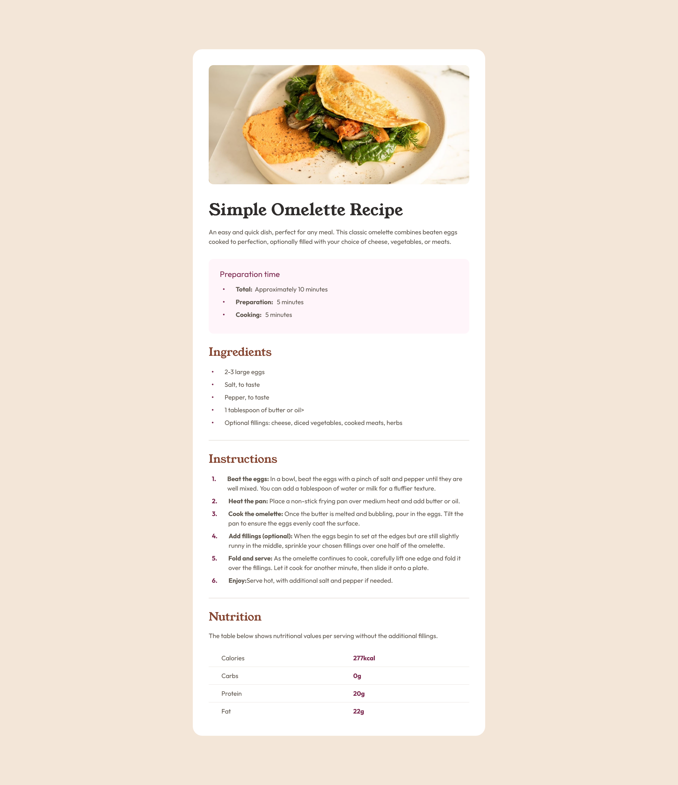

# Frontend Mentor - Recipe page solution

This is a solution to the [Recipe page challenge on Frontend Mentor](https://www.frontendmentor.io/challenges/recipe-page-KiTsR8QQKm).

## Table of contents

- [Overview](#overview)
  - [Screenshot](#screenshot)
  - [Links](#links)
- [My process](#my-process)
  - [Built with](#built-with)
  - [What I learned](#what-i-learned)
- [Project Setup](#project-setup)

## Overview

I have built the page using Vue. There wasn't any need to use Vue or any other front-end framework, but I have used it because it's the most comfortable tool for me. Furthermore, I haven't deployed Vite-based apps to GitHub pages yet, so it was another reason to use Vue.

### Screenshot Desktop




### Links

- [Solution URL](https://github.com/rmnkk/recipe-page)
- [Live Site URL](https://rmnkk.github.io/recipe-page/)

## My process

### Built with

- [Vue](https://vuejs.org/)
- [Vite](https://vitejs.dev/)
- Custom Css Properties [Variables](https://developer.mozilla.org/en-US/docs/Web/CSS/Using_CSS_custom_properties)

### What I learned

I have learnt how to deploy Vue Vite-based app to both GitHub Pages and Vercel. I have used official Vite documentation for the [deployment](https://vitejs.dev/guide/static-deploy.html#github-pages). I have used "GitHub Actions" as a source of deployment. Configurations file for GitHub Actions with pnpm is [here](https://github.com/rmnkk/recipe-page/blob/gh-pages/.github/workflows/static.yml).

## Project setup

If you want to test the project on your own machine

### Instal dependencies
```
pnpm install
```

### Compile and Hot-Reload for Development
```
pnpm dev
```

### Type-Check, Compile and Minify for Production
```
pnpm build
```

### Lint with [ESLint](https://eslint.org/)
```
pnpm lint
```